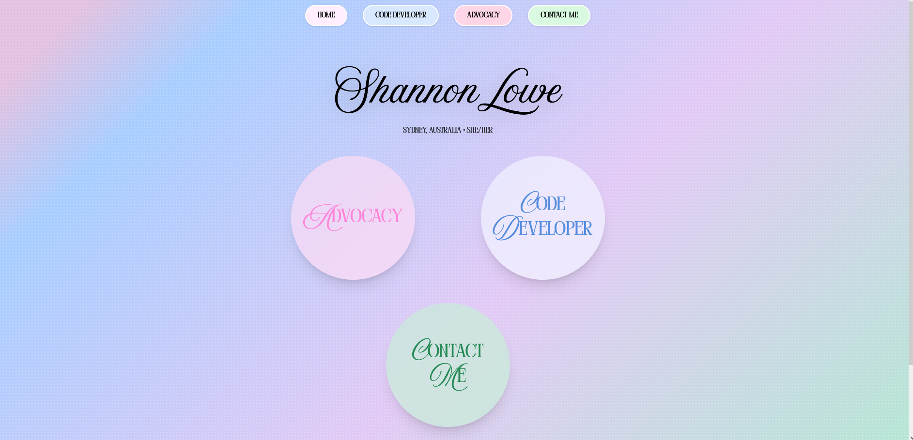
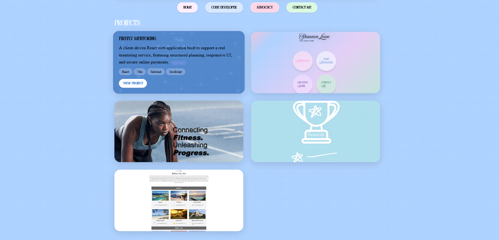
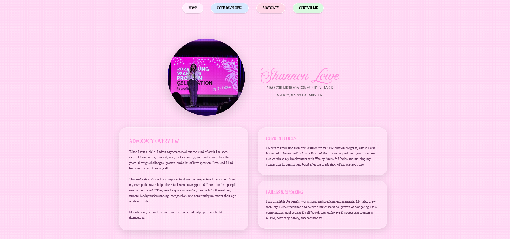
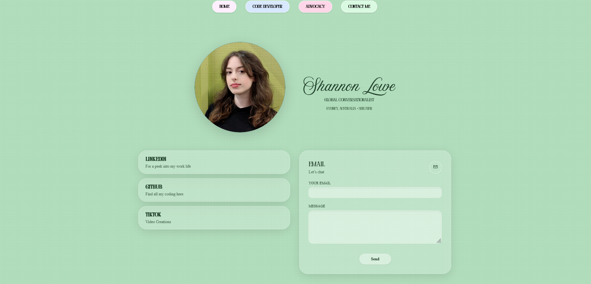

# Shannon Lowe – Developer Portfolio 

This is my personal developer portfolio built with **Vite, React, and Tailwind CSS**.  
It showcases my projects, advocacy work, and technical growth as I transition deeper into code development.

 Live site: https://shannonlowe.dev

---

## Tech Stack

- **Vite** – fast build tooling and dev server
- **React** – component-based UI
- **Tailwind CSS** – utility-first styling
- **Framer Motion** – subtle animations and interactions
- **GitHub Pages** – hosting
- **GitHub Actions** – CI/CD deployment pipeline

---

## Features

- Fully responsive layout
- Animated UI elements
- Project showcase with images
- Advocacy & community-focused sections
- Custom domain deployment
- Modern asset handling via Vite

---

## Challenges & Learnings

This project came with several real-world challenges that pushed my understanding beyond local development:

### 1. Learning Framer Motion (Bubble Grid Animations)

One of the most challenging and rewarding parts of this project was implementing animations using **Framer Motion**, particularly for the **bubble grid layout** on the homepage.

This required me to:
- Understand how `motion.div` works within React components
- Manage hover, scale, and transition animations
- Balance animation smoothness with responsiveness
- Ensure animations didn’t break layout or accessibility

Getting the bubble grid to feel **playful but controlled** took experimentation and iteration, and helped build my confidence working with animation libraries in real projects.

---

### 2. Teaching Myself Tailwind CSS

This project was also a deep dive into **Tailwind CSS**, which was new to me at the time.

Key learnings included:
- Thinking in utility classes instead of traditional CSS files
- Structuring layouts using Flexbox and Grid utilities
- Managing responsive styles with Tailwind breakpoints
- Avoiding class clutter while keeping styles readable
- Understanding how Tailwind works with Vite at build time

By the end of the project, Tailwind became a productivity tool rather than an obstacle, and I’m now comfortable styling components quickly and consistently.

---

### 3. Creating a Responsive Gradient Background

A core visual element of the site is the **custom gradient background**, which needed to remain responsive across devices while maintaining visual consistency.

---

### 4. Debugging Under Pressure
There were moments where:
- The site was blank
- Special fonts were not being applied
- Creating a Responsive Gradient Background

Working through these issues improved my ability to:
- Debug systematically
- Isolate variables
- Stay calm and persistent when things don’t “just work”

---

## Screenshots

### Homepage

### Projects Section

### Advocacy Page

### Contact Page
